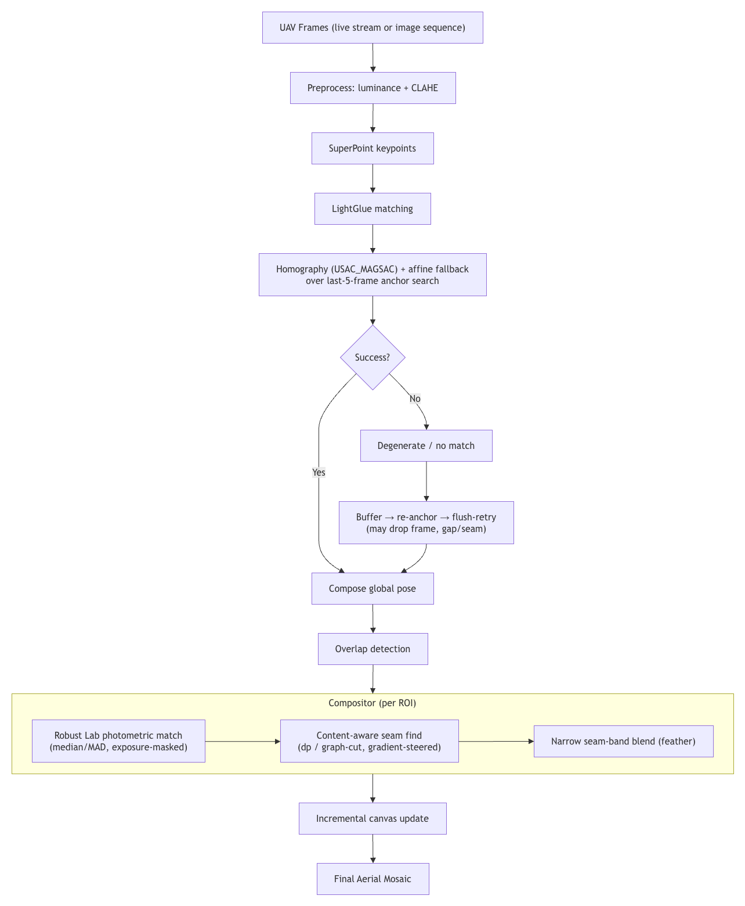
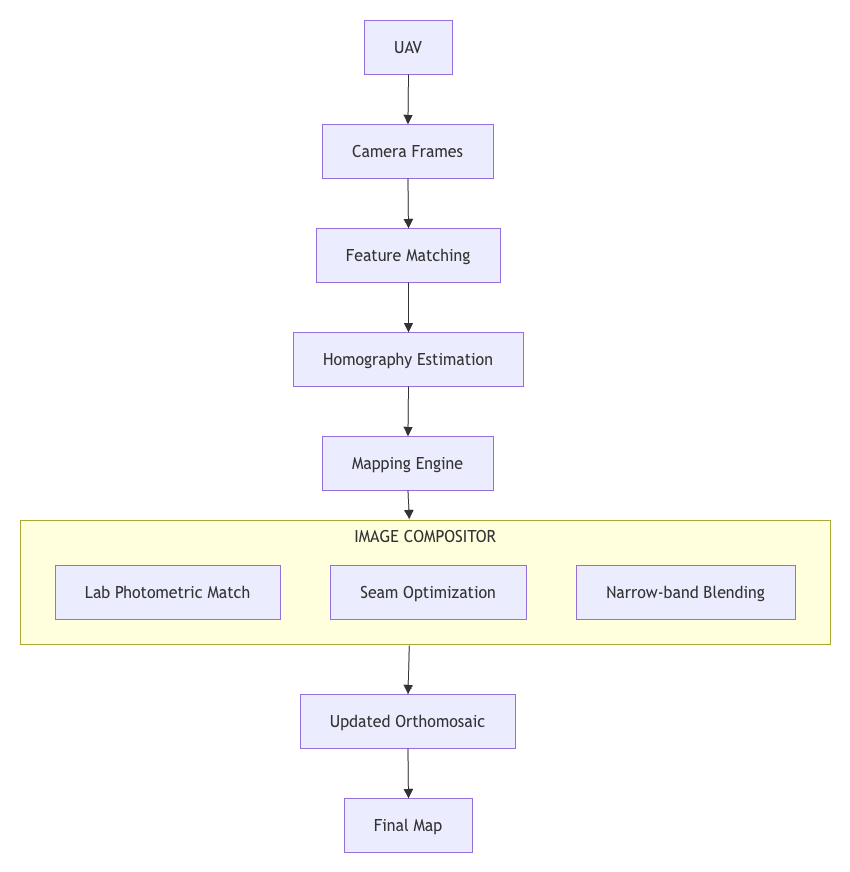
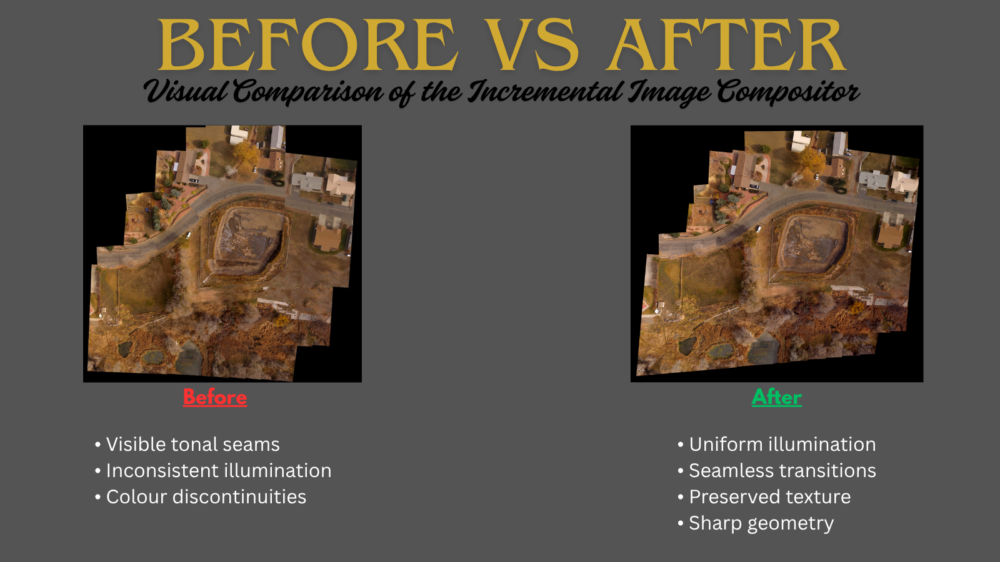

<p align="center">
  
</p>

<h1 align="center">Real-Time UAV Mapping</h1>

<p align="center">
An Incremental Image Compositor for Seamless Aerial Orthomosaic Generation
</p>

<p align="center">
  
  
  
  
  
</p>

---
# Project Overview

Building high-quality aerial maps in real time is a fundamental challenge in autonomous UAV systems. As a drone captures images during flight, every incoming frame can differ in illumination, exposure, colour balance, and viewpoint. Simply overlaying images produces visible seams, while traditional blending techniques often remove those seams at the cost of blurring textures and reducing geometric fidelity.

This project presents an **incremental image compositor** designed specifically for **on-loop UAV mapping**, where each frame must be processed and integrated into the existing mosaic immediately. Instead of relying on computationally expensive global optimization, the compositor performs **Lab-space photometric matching**, **dynamic seam optimization**, and **narrow seam-band blending** to generate visually seamless aerial orthomosaics while preserving fine structural details.

The final system produces colour-consistent, sharp and seamless aerial mosaics suitable for long-duration mapping missions, making it robust for deployment in real-time UAV applications.

# Why On-Loop Mapping is Challenging

Generating aerial mosaics in real time is significantly more challenging than stitching images offline. During flight, a UAV continuously captures images while simultaneously updating the map, leaving only a fraction of a second to process each incoming frame.

Several factors make this problem difficult:

- **Photometric Variations:** Changes in sunlight, shadows, and camera auto-exposure introduce noticeable brightness and colour differences between consecutive frames.
- **Incremental Processing:** Every frame must be integrated immediately into the existing mosaic without reprocessing the entire map.
- **Visible Seams:** Simple image overlays create abrupt boundaries that reduce the visual quality of the final orthomosaic.
- **Preserving Detail:** While aggressive blending can hide seams, it often blurs textures, roads, buildings, and other fine structures after repeated updates.

The objective of this project is to eliminate these visual inconsistencies while preserving geometric fidelity and texture quality, enabling the generation of seamless aerial mosaics suitable for long-duration autonomous UAV missions.

# Key Contributions

- Developed an **incremental image compositor** for real-time UAV mapping that seamlessly integrates incoming frames into an evolving aerial mosaic.

- Designed a **Lab-space photometric matching** module to compensate for exposure and colour inconsistencies between consecutive frames.

- Implemented **dynamic seam optimization** to identify visually optimal stitching boundaries and minimize seam visibility.

- Introduced **narrow seam-band blending**, preserving image sharpness while eliminating the cumulative blur commonly observed with full-overlap blending techniques.

- Built a **robust and crash-safe compositing pipeline**, ensuring reliable execution during long-duration mapping missions.

- Generated **high-quality orthomosaics** with consistent illumination, preserved texture, and seamless transitions suitable for autonomous UAV applications.

# System Pipeline

The proposed compositor processes every incoming UAV frame through a sequence of lightweight operations optimized for real-time aerial mapping. Each stage is designed to minimize photometric inconsistencies while preserving geometric accuracy and image sharpness.

<p align="center">
  
</p>

The pipeline consists of the following stages:

1. **Image Registration**  
   Aligns the incoming frame with the existing orthomosaic using feature matching and homography estimation.

2. **Overlap Detection**  
   Identifies the common region shared between the new frame and the existing mosaic.

3. **Lab-space Photometric Matching**  
   Normalizes brightness and colour differences across overlapping regions to ensure visual consistency.

4. **Dynamic Seam Optimization**  
   Computes an optimal stitching boundary through visually insignificant regions, minimizing noticeable transitions.

5. **Narrow Seam-band Blending**  
   Blends only a thin region surrounding the seam, preserving image sharpness while avoiding cumulative blur.

6. **Incremental Mosaic Update**  
   Integrates the processed frame into the existing orthomosaic without reprocessing previously stitched regions, enabling efficient real-time operation.

# System Architecture

The image compositor operates as the final stage of the UAV mapping pipeline, receiving geometrically aligned frames from the mapping engine and producing a visually consistent orthomosaic. While the upstream modules are responsible for registration and pose estimation, the compositor focuses on eliminating photometric inconsistencies and stitching artifacts before updating the global map.

<p align="center">
  
</p>

The compositor integrates three core modules:

- **Photometric Matching** – Corrects illumination and colour variations between overlapping frames.
- **Seam Optimization** – Identifies visually optimal boundaries for stitching.
- **Narrow Seam-band Blending** – Restricts blending to a small region around the seam, preserving texture and geometric details across the remaining image.

This modular design allows the compositor to be integrated into real-time UAV mapping pipelines while maintaining high visual quality and computational efficiency.

# Results

The final compositor successfully generates visually consistent aerial orthomosaics by combining photometric normalization with seam-aware blending. Unlike conventional incremental blending approaches, the proposed method preserves image sharpness while eliminating noticeable exposure transitions across frame boundaries.

<p align="center">
  
</p>

The resulting orthomosaic demonstrates:

- **Seamless frame integration** with minimal visible stitching artifacts.
- **Consistent illumination and colour balance** across the mapped region.
- **Preserved fine textures**, including roads, vegetation and structural details.
- **Sharp geometric alignment** without the cumulative blur typically introduced by repeated blending operations.

The compositor is specifically designed for incremental UAV mapping, enabling each incoming frame to be integrated efficiently without degrading the quality of previously stitched regions.

# Before vs After

The comparison below illustrates the visual improvements achieved by the proposed compositor. The previous approach exhibits noticeable tonal discontinuities and visible stitching boundaries, whereas the final compositor produces a visually coherent orthomosaic with consistent illumination and preserved image sharpness.

<p align="center">
  
</p>

### Improvements

| Previous Approach | Final Compositor |
|-------------------|------------------|
| Visible tonal seams | Seamless transitions |
| Inconsistent illumination | Uniform brightness and colour |
| Noticeable stitching boundaries | Optimized seam placement |
| Conventional overlap blending | Narrow seam-band blending |
| Reduced visual consistency | Sharp and coherent orthomosaic |


# Repository Structure
```text
REAL_TIME_UAV_MAPPING/
│
├── assets/                      # README visuals
│   ├── banner.png
│   ├── pipeline.png
│   ├── architecture.png
│   └── comparison.png
│
├── docs/
│   └── compositor_v1_to_v4_report.pdf
│
├── images/                      # Mapping outputs
│   ├── before.jpeg
│   ├── after.png
│   └── final_map.png
│
├── notebooks/
│   └── compositor_v4.ipynb
│
|-- Dataset
├── README.md
├── requirements.txt
├── LICENSE
└── .gitignore
```

# Installation

Clone the repository:

```bash
git clone https://github.com/abhijeet-2125/REAL_TIME_UAV_MAPPING.git
cd REAL_TIME_UAV_MAPPING
```

Install the required dependencies:

```bash
pip install -r requirements.txt
```

# License

This project is licensed under the MIT License.

See the `LICENSE` file for more details.

# Author

**Abhijeet Kumar**

B.Tech Artificial Intelligence & Data Analytics

Indian Institute of Technology Madras

If you found this project useful or have suggestions for improvement, feel free to connect or open an issue.